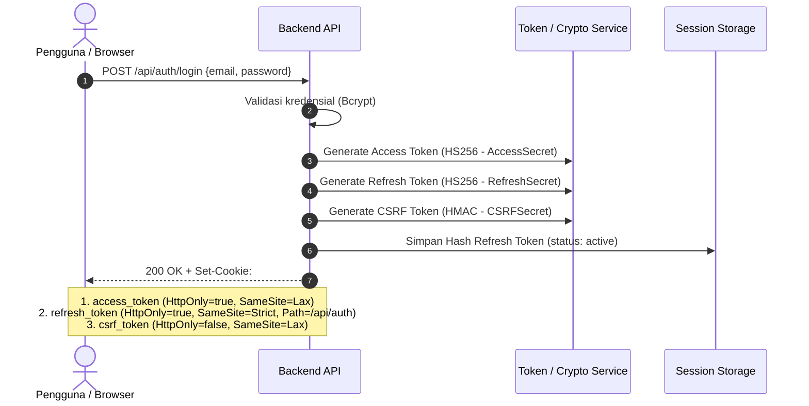
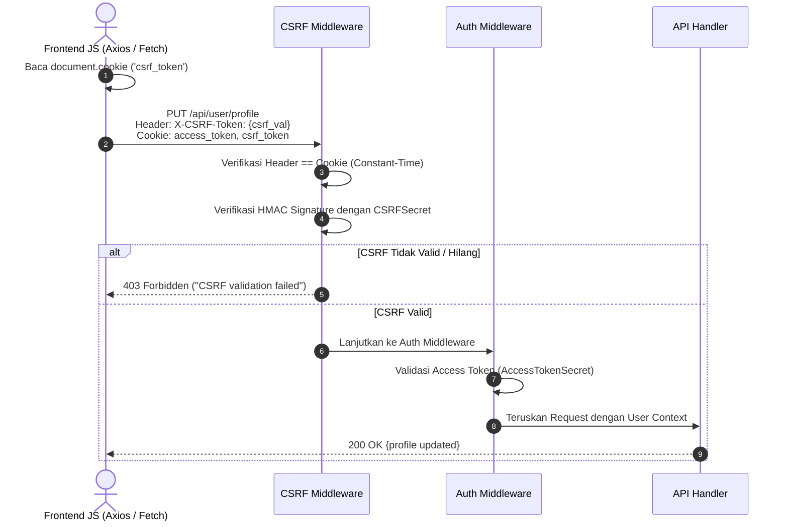
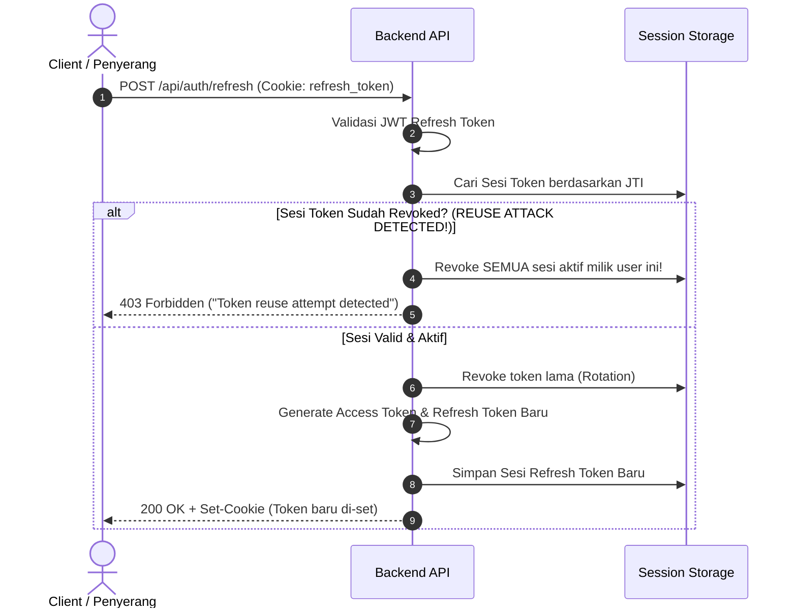
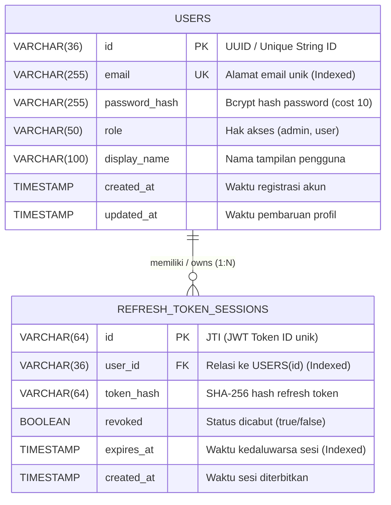
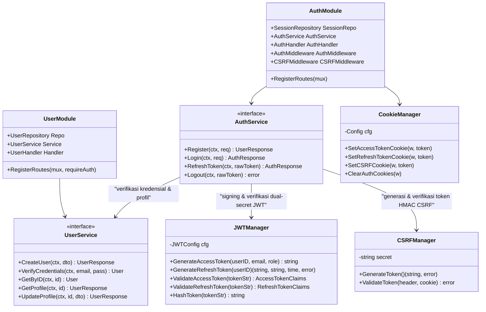
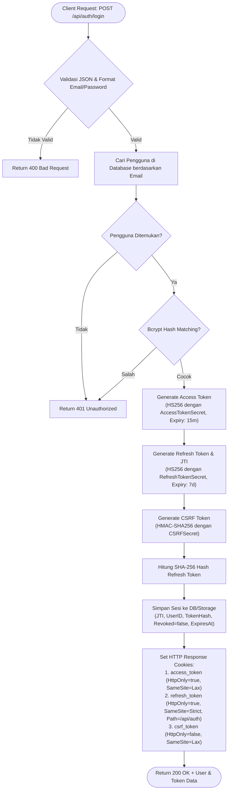
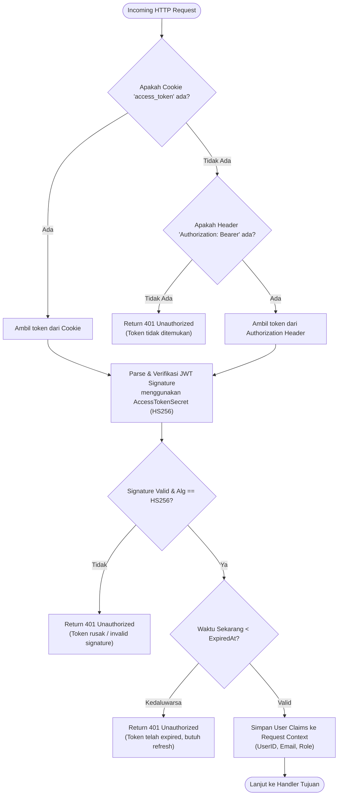
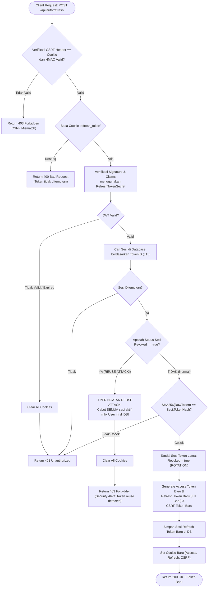

# Web API - Modular Monolith Authentication & CSRF Protection

Implementasi backend API RESTful menggunakan **Golang** dengan arsitektur **Modular Monolith**, menerapkan standar keamanan industri untuk:
1. **Access Token & Refresh Token** dengan **Secret Token terpisah** (*Dual-Secret Isolation*).
2. **Refresh Token Rotation (RTR)** dan deteksi serangan penggunaan ulang (**Reuse Attack Detection** / RFC 6819).
3. **Cookie Keamanan Tinggi** (`HttpOnly`, `SameSite=Strict/Lax`, `Secure`, `Path isolation`).
4. **Proteksi CSRF** berbasis **Double Submit Cookie** bertanda tangan kriptografis (**HMAC-SHA256**).

---

## 📑 Daftar Isi

- [Arsitektur: Modular Monolith](#-arsitektur-modular-monolith)
- [Konsep & Spesifikasi Keamanan](#-konsep--spesifikasi-keamanan)
  - [1. Secret Token Terpisah (Dual-Secret & CSRF-Secret)](#1-secret-token-terpisah-dual-secret--csrf-secret)
  - [2. Spesifikasi Cookie Keamanan Tinggi](#2-spesifikasi-cookie-keamanan-tinggi)
  - [3. Proteksi CSRF: Double Submit Cookie + HMAC](#3-proteksi-csrf-double-submit-cookie--hmac)
  - [4. Refresh Token Rotation (RTR) & Reuse Attack Detection](#4-refresh-token-rotation-rtr--reuse-attack-detection)
- [Diagram Alur (Sequence Diagrams)](#-diagram-alur-sequence-diagrams)
  - [Alur Login & Distribusi Cookie](#1-alur-login--distribusi-cookie)
  - [Alur Mutasi Data dengan Proteksi CSRF](#2-alur-mutasi-data-dengan-proteksi-csrf)
  - [Alur Refresh Token Rotation & Deteksi Serangan Reuse](#3-alur-refresh-token-rotation--deteksi-serangan-reuse)
- [Entity-Relationship Diagram (ERD Database)](#-entity-relationship-diagram-erd-database)
- [UML Class Diagram](#-uml-class-diagram)
- [Flowchart Implementasi JWT](#-flowchart-implementasi-jwt)
  - [1. Flowchart Login & Penerbitan Token](#1-flowchart-login--penerbitan-token)
  - [2. Flowchart Autorisasi Access Token (Middleware)](#2-flowchart-autorisasi-access-token-middleware)
  - [3. Flowchart Refresh Token Rotation & Mitigasi Reuse Attack](#3-flowchart-refresh-token-rotation--mitigasi-reuse-attack)
- [Daftar Endpoint API](#-daftar-endpoint-api)
- [Konfigurasi Environment](#-konfigurasi-environment)
- [Panduan Menjalankan & Pengujian](#-panduan-menjalankan--pengujian)
- [Contoh Pengujian via cURL](#-contoh-pengujian-via-curl)

---

## 🏗️ Arsitektur: Modular Monolith

Aplikasi dibangun sebagai monolit tunggal yang dideploy dalam satu binary, namun secara internal dibagi menjadi modul-modul independen (*Bounded Contexts*) tanpa ketergantungan melingkar (*no circular imports*):

```
.
├── cmd/
│   └── api/
│       └── main.go                         # Entrypoint aplikasi, wiring modul & HTTP server
├── config/
│   └── config.go                          # Konfigurasi aplikasi & environment variables
├── pkg/                                   # Shared Platform & Infrastructure primitives
│   ├── cookie/
│   │   ├── cookie.go                      # Abstraksi cookie (HttpOnly, SameSite, Secure, Path)
│   │   └── cookie_test.go                 # Unit test cookie manager
│   └── security/
│       ├── jwt.go                         # Provider JWT dengan dual secret terpisah
│       ├── csrf.go                        # HMAC Double-Submit CSRF Provider
│       ├── context.go                     # Context claims helper yang ter-dekupel
│       ├── jwt_test.go                    # Unit test isolasi dual-secret & expiry
│       └── csrf_test.go                   # Unit test verifikasi & anti-pemalsuan HMAC
├── modules/                               # Bounded Context Modules
│   ├── auth/                              # Modul Autentikasi & Sesi
│   │   ├── domain/session.go              # Entitas session, DTO login/token, domain errors
│   │   ├── repository/session_repository.go # Pelacakan rotasi token & status revokasi
│   │   ├── service/auth_service.go        # Business logic login, RTR, reuse detection, logout
│   │   ├── handler/auth_handler.go        # HTTP handler autentikasi
│   │   ├── middleware/auth_middleware.go  # Validasi Access Token (Cookie & Bearer fallback)
│   │   ├── middleware/csrf_middleware.go  # Verifikasi CSRF pada mutasi data
│   │   └── module.go                      # Wiring internal modul Auth & pendaftaran rute
│   └── user/                              # Modul Pengelolaan Pengguna
│       ├── domain/user.go                 # Entitas user & DTOs
│       ├── repository/user_repository.go  # Persistence user
│       ├── service/user_service.go        # Hashing bcrypt & business logic profil
│       ├── handler/user_handler.go        # HTTP handler profil & update
│       └── module.go                      # Wiring internal modul User & pendaftaran rute
└── tests/
    └── auth_flow_test.go                  # End-to-end integration test
```

### Prinsip Modul:
1. **Low Coupling, High Cohesion**: Modul `user` tidak mengimpor modul `auth`. Komunikasi identitas login dilakukan melalui helper context di `pkg/security` dan dependensi eksplisit antarmuka (*interface*).
2. **Single Responsibility**: `pkg/security` murni menangani kriptografi token; `modules/auth` menangani aturan bisnis autentikasi, pelacakan sesi, dan deteksi ancaman.

---

## 🔐 Konsep & Spesifikasi Keamanan

### 1. Secret Token Terpisah (Dual-Secret & CSRF-Secret)

Untuk mencegah kebocoran menyeluruh (*limiting blast radius*), sistem menggunakan tiga kunci rahasia berbeda:

* `ACCESS_TOKEN_SECRET`: Digunakan untuk menandatangani Access Token (HS256, masa aktif pendek: 15 menit).
* `REFRESH_TOKEN_SECRET`: Digunakan untuk menandatangani Refresh Token (HS256, masa aktif panjang: 7 hari). Jika secret access token bocor, penyerang tetap tidak dapat memalsukan refresh token untuk memperpanjang sesi.
* `CSRF_SECRET`: Digunakan untuk menghitung tanda tangan HMAC-SHA256 pada token CSRF, mencegah injeksi atau manipulasi token oleh pihak ketiga.

### 2. Spesifikasi Cookie Keamanan Tinggi

| Nama Cookie | HttpOnly | SameSite | Secure | Path | Alasan & Mekanisme Pertahanan |
|---|:---:|:---:|:---:|:---:|---|
| **`access_token`** | **`true`** | `Lax` | `true` (prod) | `/` | **Mencegah XSS**. Script JavaScript (`document.cookie`) tidak dapat membaca token akses. Browser otomatis mengirimkannya pada request API domain yang sama. |
| **`refresh_token`** | **`true`** | **`Strict`** | `true` (prod) | **`/api/auth`** | **Isolasi Path & Proteksi CSRF Maksimal**. Endpoint data umum (seperti `/api/user/profile`) tidak akan pernah menerima cookie ini. Nilai `Strict` memblokir pengiriman cookie bahkan saat pengguna mengklik tautan dari situs eksternal. |
| **`csrf_token`** | **`false`** | `Lax` | `true` (prod) | `/` | **Wajib `false`** agar script frontend (React, Vue, Axios) dapat membaca token dan menyalinnya ke header HTTP `X-CSRF-Token` pada pola *Double Submit Cookie*. |

### 3. Proteksi CSRF: Double Submit Cookie + HMAC

Serangan *Cross-Site Request Forgery* terjadi saat browser korban secara otomatis menyertakan cookie autentikasi ke server target saat dipicu oleh situs jahat. Mekanisme mitigasi:
1. **Penerbitan Token**: Backend menghasilkan string acak (*nonce*) 32 byte dan menandatanganinya dengan `CSRF_SECRET` menggunakan HMAC-SHA256: `<nonce>.<hmac_signature>`. Token ini disimpan di cookie `csrf_token` (`HttpOnly: false`).
2. **Pengiriman oleh Klien**: Pada request yang mengubah status data (`POST`, `PUT`, `DELETE`, `PATCH`), frontend membaca cookie tersebut dan mengirimkannya kembali di header request:
   ```http
   X-CSRF-Token: <nonce>.<hmac_signature>
   ```
3. **Validasi Server**:
   * Metode aman (`GET`, `HEAD`, `OPTIONS`) dilewati dari validasi CSRF.
   * Nilai header `X-CSRF-Token` harus identik dengan nilai cookie `csrf_token` (menggunakan `subtle.ConstantTimeCompare` untuk mencegah *timing attack*).
   * Tanda tangan kriptografis diverifikasi ulang menggunakan `CSRF_SECRET`. Hal ini mencegah penyerang memanfaatkan celah injeksi cookie di subdomain untuk membuat token palsu.

### 4. Refresh Token Rotation (RTR) & Reuse Attack Detection

Berdasarkan rekomendasi **RFC 6749** & **RFC 6819**:
* **Rotasi Sekali Pakai**: Setiap kali endpoint `/api/auth/refresh` dipanggil, refresh token yang digunakan langsung ditandai sebagai **Revoked (Dicabut)**, dan pasangan token baru diterbitkan.
* **Deteksi Penggunaan Ulang (Reuse Detection)**:
  - Jika klien mengirimkan refresh token yang statusnya *sudah dicabut* sebelumnya, ini menandakan bahwa token lama telah dicuri atau bocor ke pihak penyerang.
  - Sistem secara otomatis memicu **Revokasi Massal**: seluruh refresh token aktif milik pengguna tersebut langsung dicabut, dan request ditolak dengan HTTP 403 Forbidden. Pengguna dipaksa login ulang.

---

## 🔄 Diagram Alur (Sequence Diagrams)

### 1. Alur Login & Distribusi Cookie



### 2. Alur Mutasi Data dengan Proteksi CSRF



### 3. Alur Refresh Token Rotation & Deteksi Serangan Reuse



---

## 🗄️ Entity-Relationship Diagram (ERD Database)

Berikut adalah rancangan ERD untuk persistensi data pengguna dan sesi refresh token. Pada basis data relasional (PostgreSQL / MySQL), relasi yang digunakan adalah **1-to-N (One-to-Many)**: Satu pengguna dapat memiliki banyak sesi refresh token aktif (misal login dari laptop, smartphone, tablet).



### Kamus Data & Catatan Desain Basis Data:
1. **Keamanan Hash Token (`token_hash`)**:
   - Refresh token **TIDAK PERNAH** disimpan dalam bentuk plain-text di database. Yang disimpan adalah nilai hash **SHA-256**. Jika basis data mengalami kebocoran (*data breach*), penyerang tidak dapat merekonstruksi refresh token asli untuk membajak sesi pengguna.
2. **Kunci Primer JTI (`id`)**:
   - Kolom `id` pada tabel `REFRESH_TOKEN_SESSIONS` memetakan langsung ke klaim standar JWT `jti` (*JWT ID*). Ini memungkinkan pencarian sesi dengan kompleksitas $O(1)$ tanpa perlu memindai seluruh tabel.
3. **Optimasi Indeks**:
   - `USERS(email)`: `UNIQUE INDEX` untuk lookup login yang instan.
   - `REFRESH_TOKEN_SESSIONS(user_id)`: `INDEX` untuk mempercepat operasi pencabutan massal (*mass revocation*) saat deteksi reuse attack terjadi.
   - `REFRESH_TOKEN_SESSIONS(expires_at)`: `INDEX` untuk mempermudah cron job pembersihan (*cleanup garbage collection*) sesi basi.

---

## 📊 UML Class Diagram

Diagram kelas ini mengilustrasikan keterhubungan antarmuka (*interface*), modul-modul independen (*Modular Monolith*), dan dependensi pemanggilan internal:



### 📋 Penjelasan Komponen & Hubungan Antar Modul:
1. **`UserModule`**:
   - Berfungsi sebagai *Bounded Context* pengelolaan pengguna.
   - Mengenkapsulasi `UserRepository` (persistensi data), `UserService` (logika bisnis & hashing kata sandi), dan `UserHandler` (endpoint HTTP profil).
2. **`AuthModule`**:
   - Berfungsi sebagai *Bounded Context* autentikasi dan sesi keamanan.
   - Mengenkapsulasi `SessionRepository` (pelacakan status refresh token), `AuthService` (orkestrasi login, rotasi token, dan deteksi reuse attack), `AuthHandler` (endpoint HTTP autentikasi), serta `AuthMiddleware` dan `CSRFMiddleware`.
3. **`JWTManager` (`pkg/security`)**:
   - Komponen platform keamanan yang mengelola penandatanganan dan validasi JWT.
   - Memastikan pemisahan mutlak (*cryptographic isolation*) antara `AccessTokenSecret` (durasi pendek) dan `RefreshTokenSecret` (durasi panjang).
4. **`CSRFManager` (`pkg/security`)**:
   - Menghasilkan token CSRF bertanda tangan HMAC-SHA256 (`<nonce>.<signature>`) menggunakan `CSRFSecret`.
   - Melakukan validasi token *Double Submit* dengan perbandingan waktu-konstan (*constant-time comparison*) untuk menangkal serangan waktu (*timing attacks*).
5. **`CookieManager` (`pkg/cookie`)**:
   - Mengelola atribut keamanan cookie HTTP (`HttpOnly`, `SameSite`, `Secure`, `Path`, dan `MaxAge`) secara seragam dan terpusat.
6. **Pola Komunikasi Antar Modul (Decoupled & Inverted)**:
   - `AuthService` berkomunikasi dengan modul pengguna murni melalui antarmuka `UserService` (tidak mengakses repository pengguna secara langsung).
   - Middleware autentikasi menyuntikkan klaim identitas ke `r.Context()` melalui abstraksi `pkg/security/context.go`, sehingga modul lain (seperti modul `user`) dapat membaca identitas pengguna tanpa harus mengimpor modul `auth`.

---

## 🔀 Flowchart Implementasi JWT

### 1. Flowchart Login & Penerbitan Token

Alur penerbitan token saat pengguna melakukan autentikasi kredensial:



#### 📝 Penjelasan Detail Alur Login:
1. **Validasi Request & Lookup Pengguna**:
   - Klien mengirimkan `POST /api/auth/login` membawa payload `{ email, password }`.
   - Handler memvalidasi kelengkapan format payload JSON, lalu mencari entitas akun pengguna di database berdasarkan email.
2. **Verifikasi Hash Kata Sandi (Bcrypt)**:
   - Kata sandi plain-text diverifikasi terhadap `password_hash` menggunakan `bcrypt.CompareHashAndPassword`. Jika tidak cocok, request langsung ditolak dengan `401 Unauthorized`.
3. **Penerbitan Dual-Secret Token & CSRF**:
   - **Access Token**: Dibuat dengan algoritma HS256 berdurasi 15 menit menggunakan `AccessTokenSecret`.
   - **Refresh Token**: Dibuat dengan ID token unik (JTI) berdurasi 7 hari menggunakan `RefreshTokenSecret`.
   - **CSRF Token**: Dibuat dengan format `<nonce_acak>.<hmac_signature>` menggunakan `CSRFSecret`.
4. **Persistensi Hash Sesi Token**:
   - Refresh token di-hash menggunakan SHA-256 dan disimpan ke tabel sesi database bersama dengan masa kedaluwarsa (`expires_at`), ID pengguna (`user_id`), dan status aktif (`revoked = false`).
5. **Pengaturan Cookie HTTP yang Aman**:
   - `access_token`: Disetel dengan `HttpOnly=true` dan `SameSite=Lax`.
   - `refresh_token`: Disetel dengan `HttpOnly=true`, `SameSite=Strict`, dan dibatasi ke `Path=/api/auth`.
   - `csrf_token`: Disetel dengan `HttpOnly=false` agar dapat dibaca oleh script frontend untuk pola *Double Submit Cookie*.

---

### 2. Flowchart Autorisasi Access Token (Middleware)

Alur verifikasi setiap permintaan yang mengakses endpoint terproteksi:



#### 📝 Penjelasan Detail Alur Autorisasi Middleware:
1. **Ekstraksi Token Multi-Sumber**:
   - Middleware memeriksa keberadaan cookie `access_token` terlebih dahulu (metode utama browser).
   - Jika cookie tidak ditemukan, middleware memeriksa header `Authorization: Bearer <token>` sebagai jalur alternatif (*fallback*) untuk klien seluler, Postman, atau CLI.
   - Jika kedua sumber kosong, request langsung ditolak dengan `401 Unauthorized`.
2. **Verifikasi Tanda Tangan & Integritas Kriptografis**:
   - Token di-parse dan diverifikasi menggunakan `AccessTokenSecret`.
   - Algoritma dipastikan secara ketat berjenis HMAC-SHA256 (`jwt.SigningMethodHMAC`) untuk memitigasi serangan manipulasi algoritma (*alg: none attack* atau *RSA-to-HMAC confusion attack*).
3. **Validasi Masa Berlaku (Expiration Time)**:
   - Middleware membandingkan waktu saat ini dengan klaim `exp` (*ExpiresAt*). Jika token telah melewati masa berlakunya, request ditolak dengan pesan yang menginstruksikan klien untuk melakukan penyegaran (*refresh*) token.
4. **Penyuntikan Klaim ke Context HTTP**:
   - Setelah tervalidasi, klaim token (`UserID`, `Email`, `Role`) disimpan ke dalam `r.Context()` melalui fungsi `security.SetClaimsContext`.
   - Handler endpoint tujuan dapat langsung mengambil informasi pengguna yang terverifikasi menggunakan helper `security.GetClaimsContext(r.Context())`.

---

### 3. Flowchart Refresh Token Rotation & Mitigasi Reuse Attack

Alur pembaruan token dengan rotasi otomatis dan perlindungan ancaman pencurian sesi:



#### 📝 Penjelasan Detail Alur Refresh Token Rotation (RTR):
1. **Validasi Proteksi CSRF Terlebih Dahulu**:
   - Sebelum memproses token, middleware CSRF memastikan header `X-CSRF-Token` identik dengan cookie `csrf_token` dan memiliki tanda tangan HMAC yang sah dari `CSRFSecret`.
2. **Verifikasi JWT Refresh Token**:
   - Refresh token diekstrak dari cookie `refresh_token` (atau request body) dan diverifikasi tanda tangannya menggunakan `RefreshTokenSecret`.
3. **Pemeriksaan Sesi di Basis Data**:
   - Berdasarkan klaim `jti` (*Token ID*) pada token, sistem mencari rekaman sesi di database dan mencocokkan hash SHA-256 token.
4. **Deteksi Serangan Penggunaan Ulang (Reuse Attack Detection - RFC 6819)**:
   - **Skenario Pelanggaran**: Jika sesi yang dicari memiliki status `revoked == true`, ini berarti token lama yang telah digantikan kini dicoba digunakan kembali (indikasi token telah disadap/dicuri oleh pihak ketiga).
   - **Tindakan Perlindungan Otomatis**: Sistem langsung memicu **pencabutan massal** (*mass revocation*) untuk membatalkan seluruh sesi refresh token aktif milik pengguna tersebut di database, menghapus semua cookies di browser, dan mengembalikan `403 Forbidden`. Pengguna dipaksa login ulang.
5. **Rotasi Token Sekali Pakai (One-Time Use Rotation)**:
   - Jika sesi masih valid dan aktif, sesi token lama langsung diubah statusnya menjadi `revoked = true`.
   - Sistem menerbitkan pasangan Access Token baru, Refresh Token baru (dengan JTI baru), dan CSRF Token baru.
   - Sesi token baru disimpan ke database, dan cookies diperbarui di sisi klien.

---

## 📡 Daftar Endpoint API

| Method | Endpoint | Proteksi Auth | Proteksi CSRF | Deskripsi |
|---|---|:---:|:---:|---|
| `POST` | `/api/auth/register` | ❌ Publik | ❌ Publik | Mendaftarkan pengguna baru |
| `POST` | `/api/auth/login` | ❌ Publik | ❌ Publik | Autentikasi pengguna & set cookies |
| `GET` | `/api/csrf-token` | ❌ Publik | ❌ Publik | Mendapatkan CSRF cookie & token awal |
| `POST` | `/api/auth/refresh` | 🍪 Refresh Cookie | ✅ Wajib | Rotasi refresh token & access token baru |
| `POST` | `/api/auth/logout` | 🍪 Access Token | ✅ Wajib | Revokasi sesi & pembersihan cookies |
| `GET` | `/api/user/profile` | 🍪 Access Token | ❌ Safe Method | Melihat profil pengguna saat ini |
| `PUT` | `/api/user/profile` | 🍪 Access Token | ✅ Wajib | Memperbarui profil (mutasi data terproteksi) |

---

## ⚙️ Konfigurasi Environment

Aplikasi dapat dikonfigurasi melalui environment variables:

| Variable | Default | Keterangan |
|---|---|---|
| `PORT` | `8080` | Port listening HTTP server |
| `APP_ENV` | `development` | Set `production` untuk mengaktifkan flag `Secure=true` pada Cookie |
| `ACCESS_TOKEN_SECRET` | *(string dev)* | Secret key penandatanganan JWT Access Token (min. 32 karakter) |
| `REFRESH_TOKEN_SECRET` | *(string dev)* | Secret key penandatanganan JWT Refresh Token (min. 32 karakter) |
| `CSRF_SECRET` | *(string dev)* | Secret key penandatanganan HMAC CSRF (min. 32 karakter) |
| `ACCESS_TOKEN_TTL_MINUTES` | `15` | Masa berlaku access token (menit) |
| `REFRESH_TOKEN_TTL_DAYS` | `7` | Masa berlaku refresh token (hari) |
| `COOKIE_DOMAIN` | `""` | Domain cookie (kosongkan untuk host saat ini) |

---

## 🚀 Panduan Menjalankan & Pengujian

### 1. Menjalankan Server
```bash
go run cmd/api/main.go
```
Output log:
```
================================================================
🚀 Modular Monolith API Server berjalan di http://localhost:8080
🔒 Mode Keamanan: development (Cookie Secure: false)
📦 Modul Terpasang: [user], [auth], [security], [cookie]
🛡️  Fitur: Dual-Secret JWT, RTR, HttpOnly, SameSite, HMAC CSRF
================================================================
```

### 2. Menjalankan Pengujian Otomatis
```bash
go test -v -count=1 ./...
```
Hasil pengujian:
```
=== RUN   TestCookieManager
--- PASS: TestCookieManager (0.00s)
=== RUN   TestCSRFManager
--- PASS: TestCSRFManager (0.00s)
=== RUN   TestJWTManager_DualSecretIsolation
--- PASS: TestJWTManager_DualSecretIsolation (0.00s)
=== RUN   TestJWTManager_Expiration
--- PASS: TestJWTManager_Expiration (0.00s)
=== RUN   TestEndToEndAuthFlow
--- PASS: TestEndToEndAuthFlow (0.09s)
PASS
ok      github.com/yudhiana/web-api/pkg/cookie      0.003s
ok      github.com/yudhiana/web-api/pkg/security    0.003s
ok      github.com/yudhiana/web-api/tests           0.096s
```

---

## 💻 Contoh Pengujian via cURL

### 1. Registrasi Akun
```bash
curl -i -X POST http://localhost:8080/api/auth/register \
  -H "Content-Type: application/json" \
  -d '{
    "email": "user@example.com",
    "password": "Password123!",
    "display_name": "Budi Santoso",
    "role": "user"
  }'
```

### 2. Login (Menyimpan Cookies)
```bash
curl -i -c cookies.txt -X POST http://localhost:8080/api/auth/login \
  -H "Content-Type: application/json" \
  -d '{
    "email": "user@example.com",
    "password": "Password123!"
  }'
```
*File `cookies.txt` akan berisi cookie `access_token`, `refresh_token`, dan `csrf_token`.*

### 3. Akses Data Terproteksi (GET)
```bash
curl -i -b cookies.txt http://localhost:8080/api/user/profile
```

### 4. Mutasi Data Terproteksi Auth & CSRF (PUT)
Ambil nilai token CSRF dari `cookies.txt`:
```bash
CSRF_VAL=$(grep "csrf_token" cookies.txt | awk '{print $7}')

curl -i -b cookies.txt -X PUT http://localhost:8080/api/user/profile \
  -H "Content-Type: application/json" \
  -H "X-CSRF-Token: $CSRF_VAL" \
  -d '{"display_name": "Budi Santoso Terupdate"}'
```
*Catatan: Jika header `X-CSRF-Token` tidak dikirim atau salah, server akan menolak dengan status HTTP 403 Forbidden.*

### 5. Refresh Token Rotation (RTR)
```bash
curl -i -b cookies.txt -c cookies.txt -X POST http://localhost:8080/api/auth/refresh \
  -H "X-CSRF-Token: $CSRF_VAL"
```
*Server akan mencabut token lama dan memperbarui file `cookies.txt` dengan pasangan token yang baru.*

### 6. Logout (Pembersihan Cookies)
```bash
curl -i -b cookies.txt -c cookies.txt -X POST http://localhost:8080/api/auth/logout \
  -H "X-CSRF-Token: $CSRF_VAL"
```
*Cookies akan dibersihkan dari browser dengan `MaxAge: -1`.*
